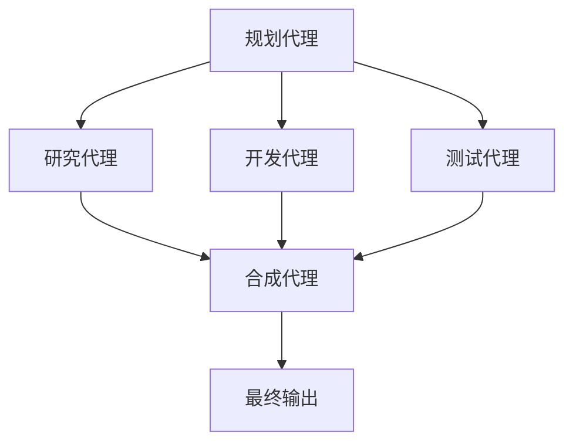

# Introduction to Agentic Engineering

## 什么是 Agentic Engineering？

Agentic Engineering 是一个新兴的技术领域，专注于设计、构建和部署能够自主执行复杂任务的 AI 代理系统。这个领域结合了大语言模型、决策制定、工具调用和自动化流程等多个技术栈。


## 核心概念

### 1. 自主性 (Autonomy)

AI 代理能够在没有人类直接干预的情况下执行任务：

```python
class AutonomousAgent:
    def __init__(self, tools, llm):
        self.tools = tools
        self.llm = llm
        self.memory = []
    
    def execute_task(self, objective):
        plan = self.llm.generate_plan(objective)
        results = []
        
        for step in plan:
            if step.type == "tool_call":
                result = self.tools[step.tool].execute(step.params)
                results.append(result)
            elif step.type == "reasoning":
                decision = self.llm.reason(step.context, results)
                results.append(decision)
        
        return results
```


### 2. 工具集成 (Tool Integration)

现代 AI 代理需要能够调用外部工具和 API：

- **网络搜索** - 获取实时信息
- **代码执行** - 运行计算和分析
- **数据库查询** - 访问结构化数据
- **API 调用** - 与外部服务交互

### 3. 记忆管理 (Memory Management)

有效的代理需要维护短期和长期记忆：

```typescript
interface AgentMemory {
  workingMemory: string[];      // 当前任务的上下文
  episodicMemory: Episode[];    // 历史交互记录
  semanticMemory: Knowledge[];   // 长期知识库
}
```

## 技术栈

### 核心框架

1. **LangChain** - Python/JS 领域最流行的代理框架
2. **AutoGPT** - 自主代理的开源实现
3. **CrewAI** - 多代理协作框架
4. **Microsoft AutoGen** - 企业级多代理框架

### 关键技术

```javascript
// Agent 配置示例
const agentConfig = {
  model: "gpt-4-turbo",
  tools: [
    { name: "web_search", type: "search" },
    { name: "code_interpreter", type: "execution" },
    { name: "database_query", type: "query" }
  ],
  memory: {
    type: "conversational",
    window_size: 10
  },
  planning: {
    strategy: "react",  // Reasoning + Acting
    max_iterations: 5
  }
};
```

## 实际应用场景

### 1. 自动化数据分析

```python
# 分析销售数据的自主代理
sales_analyst = Agent(
    tools=["sql_database", "data_visualization", "report_generator"],
    objective="分析Q4销售趋势并生成报告"
)

result = sales_analyst.run()
# 代理会自动：
# 1. 查询数据库获取销售数据
# 2. 分析趋势和模式
# 3. 生成可视化图表
# 4. 撰写分析报告
```

### 2. 客户服务自动化

```typescript
class CustomerServiceAgent {
  async handleCustomerRequest(query: string): Promise<Response> {
    // 分析客户意图
    const intent = await this.analyzeIntent(query);
    
    // 调用相应的工具
    switch (intent.type) {
      case "order_status":
        return await this.checkOrderStatus(intent.orderId);
      case "product_info":
        return await this.getProductInfo(intent.productId);
      case "technical_support":
        return await this.diagnoseIssue(intent.description);
    }
  }
}
```

### 3. 软件开发助手

```bash
# 开发代理自动完成代码审查
dev-assistant> review-pr --branch feature/authentication
✅ 检查代码风格和最佳实践
✅ 运行测试套件
✅ 检查安全漏洞
✅ 性能分析
✅ 生成审查报告
```

## 设计模式

### 1. ReAct 模式 (Reasoning + Acting)

```python
def react_agent(query):
    while not done:
        # Think
        thought = llm.think(f"当前状态: {state}\n查询: {query}")
        
        # Act
        action = decide_action(thought)
        observation = execute_action(action)
        
        # Observe
        state = update_state(state, action, observation)
        
        if is_complete(state, query):
            return generate_response(state)
```

### 2. 多代理协作



## 挑战与解决方案

### 1. 可靠性问题
- **问题**: LLM 输出的不确定性
- **解决方案**: 使用验证链、回退机制和置信度评分

### 2. 成本控制
- **问题**: 长时间运行的代理可能产生高额API费用
- **解决方案**: 实施智能缓存、成本预算和效率优化

### 3. 安全性考虑
- **问题**: 代理可能访问敏感资源或执行危险操作
- **解决方案**: 权限控制、沙箱环境和安全审计

## 未来展望

Agentic Engineering 正在快速发展，未来的趋势包括：

1. **更强的多模态能力** - 处理文本、图像、音频和视频
2. **改进的学习机制** - 从经验中学习并自我改进
3. **更好的协作能力** - 多代理系统的智能协调
4. **增强的安全性** - 更强大的安全控制和审计机制

## 结论

Agentic Engineering 代表了 AI 技术的重要发展方向，它让我们能够构建真正自主的智能系统。随着技术的成熟，我们可以期待在各个领域看到更多创新的代理应用。

对于开发者来说，现在是学习这个技术的最佳时机。通过掌握核心概念和实践技能，你将能够参与到这个激动人心的技术革命中。